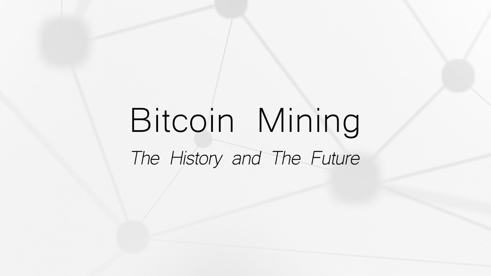
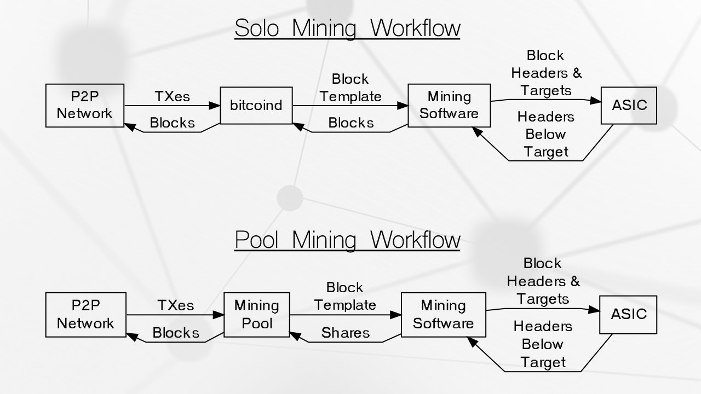
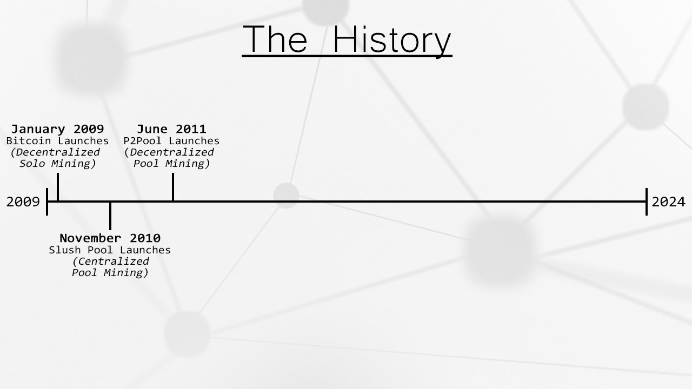
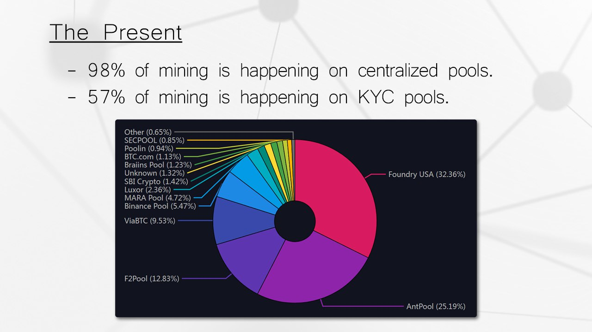
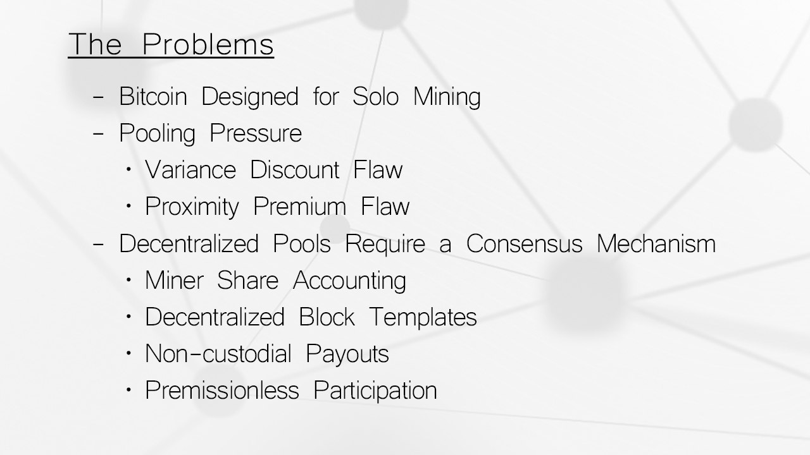
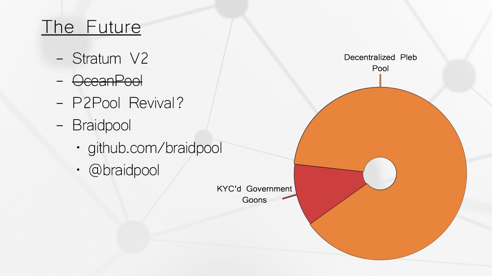

## Announcements

Please join us for our next Socratic Seminar. A special thank you to our host <a href="https://dicksprimalburger.com/" data-no-summary>Primal Burger</a>, for the event space. Please support them by buying their delicious food or a beverage.

If you can't make it to the main event please join us at Lutz Tavern around 9PM **<a href="https://www.lutztavern.com/" data-no-summary>here</a>.**

### Special Thanks | Mentions
- Tonights guest speaker. _Bitcoin Mining_

### Rules
- Respect people's privacy
- [Chatham House Rules](https://www.chathamhouse.org/about-us/chatham-house-rule)
- Interaction and asking questions are encouraged!

### Requests
- A guest speaker for Jan 23th 2024
- Artist / Graphic designed to help with branding and web applications.

### Giveaway
- [Use Guess the Nonce](https://nonce.portlandbitdevs.com/)
    - BitBox02
    - Bitcoin Blend coffee
    - Bitcoin hat

### Schedule
- **6:30 - 7:00pm:** Arrive, socialize, and grab some food.
- **7:00 - 7:45:** Member Presentation about [The State of Bitcoin Mining 2023]()
- **7:45 - 8:30pm:** Join Eric and @PortlandHODL for a Socratic Seminar as they delve into the latest updates on Bitcoin & Lightning (so many current events to talk about!)
- **8:30 - 9:00pm:** Overtime discussions about tonights topics or additional user submissions.

## Tech news
- [P2MS (PERMIT_BAREMULTISIG) discussion resurfaces as stamps usage increases](https://github.com/bitcoin/bitcoin/pull/28217)
    - Stamps bloat the UTXO set serialized size through data storage
    - This is a relay policy change, as such doesn't change consensus
    - Has positives and negatives
- [Ocean enables 3 termplates for miners to choose from](https://twitter.com/ocean_mining/status/1737745210191564958)
    - 'OCEAN Recommended' - Claims to be the best fliter for removing arbitrary data.
    - 'Ordistrspector' - Looser policy the culls inscription based scripts[]
    - Bitcoin Core '- The regular Bitcoin Core block template generation (_Takes a pool fee of 2%_)
- [Payjoin Client for Bitcoin Core released](https://github.com/payjoin/rust-payjoin/tree/master/payjoin-cli)
    - Enables a coinjoin between 2 people that appears to be a single spend onchain
- [Zeus 0.8 Released](https://github.com/ZeusLN/zeus/releases/tag/v0.8.0)
    - OLYMPUS by ZEUS 0-conf channel service
    - Zaplocker self-custodial lightning addresses
    - Taproot Channel Support
- [BTCPay Server Comprimised](https://github.com/dennisreimann/btcpayserver-plugin-lnbank/)
    - [Twitter Post](https://twitter.com/BtcpayServer/status/1739669361223172448)i
    - [Large Theft](https://stacker.news/items/347361)
- OP_CHECKTEMPLATEVERIFY regains community support
    - [Twitter Post Supporting Covenants](https://twitter.com/reardencode/status/1739059702485709212)
    - [Mailing List - Scaling Lightning with Simple Covenants](https://lists.linuxfoundation.org/pipermail/bitcoin-dev/2023-September/021941.html)
- [.4BTC Taken from ColdCard - User Error](https://www.reddit.com/r/coldcard/comments/17epqk8/040_bitcoin_taken_instantly_from_my_coldcard/)

## Market News
- Barry Silbert Resigns from Grayscale
    - [Resignation](https://www.bloomberg.com/news/articles/2023-12-26/grayscale-says-barry-silbert-resigns-as-chairman-of-the-board?embedded-checkout=true)
    - [Fraud Allegations](https://x.com/real_vijay/status/1721385528510251182?s=46)

## Mining Presentation Slides

